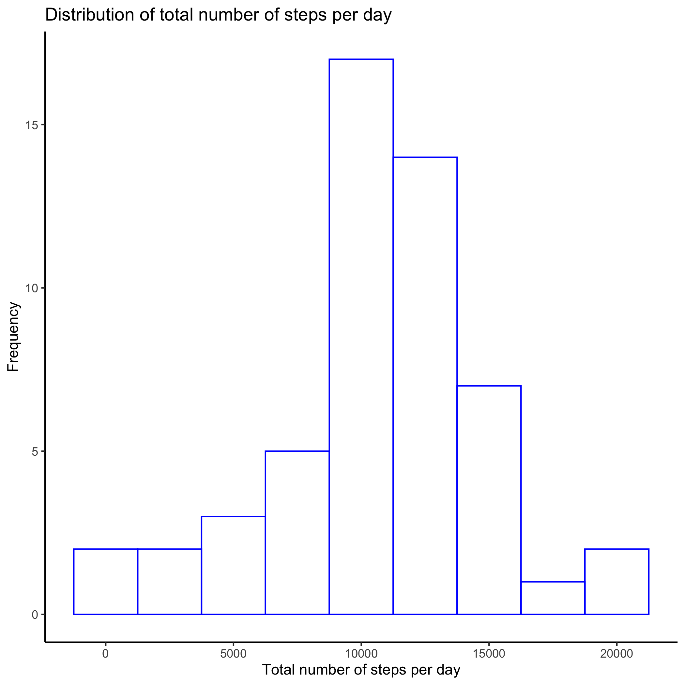
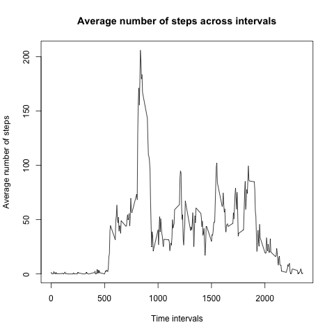
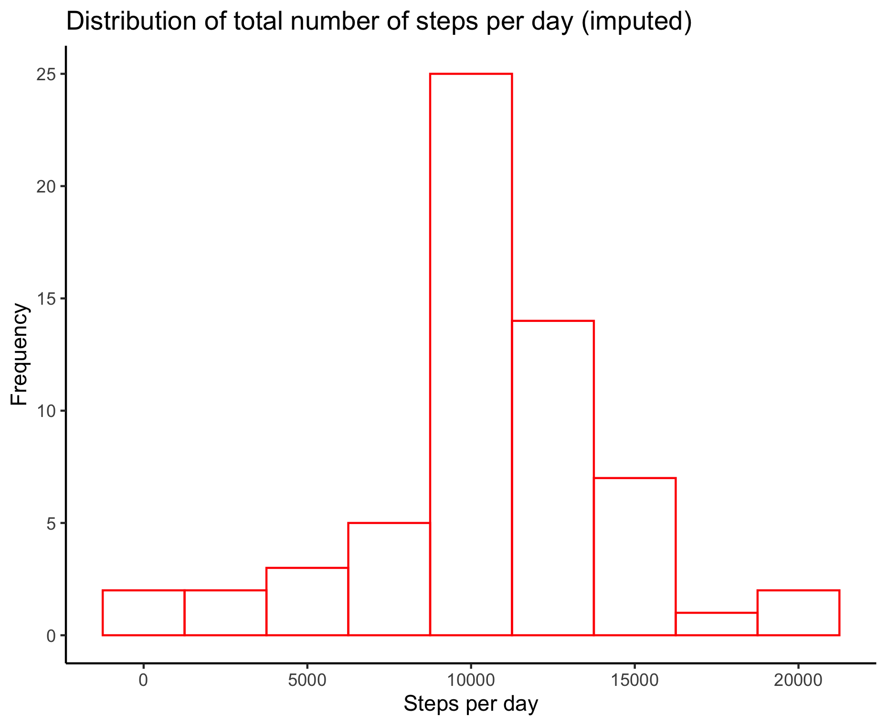
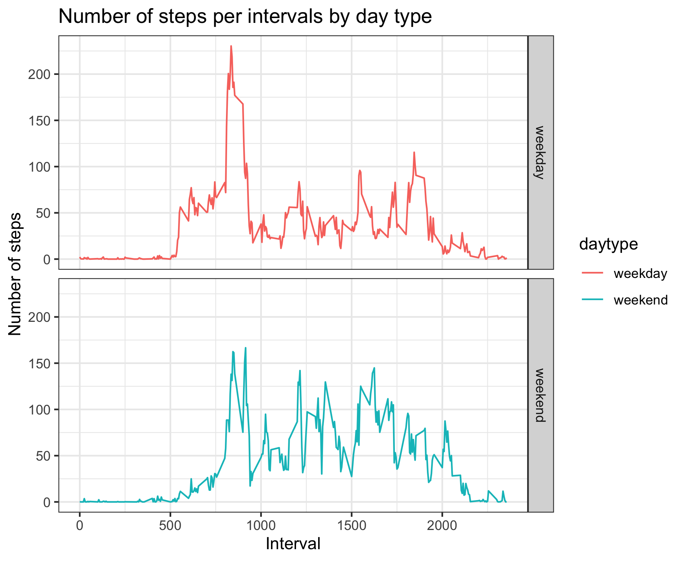

Reproducible Research - Project 1
======================================

```{r load libraries}
library(ggplot2)
library(dplyr)
library(stats)
```

### Loading and preprocessing the data

```{r - load data}
activ <- read.csv("activity.csv")

# Omit NAs
activ1 <- na.omit(activ)
```

### What is mean total number of steps taken per day? 

```{r Q1 - Histogram}
# Aggregate by date
daily_steps <- aggregate(steps ~ date, activ1, sum)

## Histogram for total no of steps per day
ggplot(daily_steps, aes(x = steps)) + 
    geom_histogram(binwidth = 2500, col = "blue", fill = NA) + theme_classic() + 
    labs(x = "Total number of steps per day", y = "Frequency", title = "Distribution of total number of steps per day")
```



```{r Q1 - summary stat}
mean_step <- round(mean(daily_steps$steps))
med_step <- round(median(daily_steps$steps))
```

The total number of steps taken per day is `r mean_step`. 
The median of the total number of steps taken per day is `r med_step`.

***

### What is the average daily activity pattern?

```{r time series plot}
# Aggregate by interval
avg_steps_per_int <- aggregate(steps ~ interval, activ1, mean)

# Time series plot
with(avg_steps_per_int, plot(y = steps, x = interval, type = "l", main = "Average number of steps across intervals", xlab = "Time intervals", ylab = "Average number of steps"))
```



```{r Q2 - max no}
Q2 <- avg_steps_per_int[which.max(avg_steps_per_int$steps),]
print(paste("Interval", Q2[1], "has the highest average number of steps, which is", round(Q2[2])))
```

***

### Imputing missing values

```{r total NA}
num_NA <- length(which(is.na(activ$steps)))
```

There are `r num_NA` of missing values in the dataset.

We then replace the missing values with the average steps of the interval that they are associated with.

```{r fill NA}
## Apply for loop to the original dataset
for(i in 1:nrow(activ)){
    if(is.na(activ$steps[i])){
        repl <- avg_steps_per_int$steps[which(avg_steps_per_int$interval == activ$interval[i])]
        activ$steps[i] <- repl
    }
}

## Aggregate steps by date
activ_date <- aggregate(steps ~ date, activ, sum)

## Histogram
ggplot(activ_date, aes(x = steps)) + geom_histogram(color = "red", fill = NA, binwidth = 2500) + theme_classic() + labs(x = "Steps per day", y = "Frequency", title = "Distribution of total number of steps per day (imputed)")
```



```{r imputed stat}
mean(activ_date$steps)
median(activ_date$steps)
```

The mean and median of the newly imputed data have not changed since the imputed values are the average number of steps of the relevant intervals.

***

### Are there differences in activity patterns between weekdays and weekends?

```{r new factor var & panel plot}
## Create a new factor variable to indicate whether it is a weekday or a weekend
activ2 <- activ
activ2$date <- as.Date(activ2$date)
activ2$daytype <- as.factor(weekdays(activ2$date))
activ2 <- activ2 %>% mutate(daytype = ifelse((daytype %in% c("Sunday", "Saturday")), "weekend", "weekday"))
activ2$daytype <- as.factor(activ2$daytype)
summary(activ2$daytype)

## Aggregate steps by weekdays or weekend
steps_by_daytype <- aggregate(steps ~ interval + daytype, activ2,  mean)

## Plot
ggplot(steps_by_daytype, aes(interval, steps)) +
    geom_line(aes(color = daytype)) +
    theme_bw() + facet_grid(daytype~.) + 
    labs(x = "Interval", y = "Number of steps", title = "Number of steps per intervals by day type")
```



We can see a subtle difference in the activity patterns between weekdays and weekends. It appears that the user would have smaller but more frequent movements during the weekend, whereas the movements spiked on the weekday mornings and follow with less regular and consistent movements.

